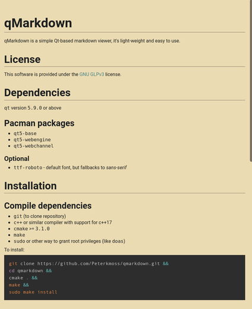
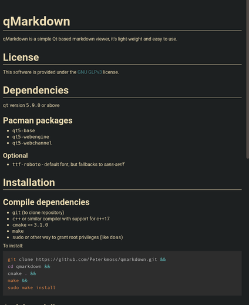

# qMarkdown

qMarkdown is a simple Qt-based markdown viewer, it's light-weight and easy to use.

## Screenshots

## License

This software is provided under the
[GNU GLPv3](https://www.gnu.org/licenses/gpl-3.0.en.html) license.

## Installation

### Distribution Packages

#### AUR package

There is an
[AUR package available](https://aur.archlinux.org/packages/qmarkdown/) for all
arch-based users

### Manual

See [installation](./docs/install.md) for further instructions.

## Usage

`qmarkdown [colorscheme] <file>`

### Colorschemes

* Light `-l` or `--light`
* Dark `-d` or `--dark`

### Keybindings

* `q` - Exits the program
* `g` - Go to TOP of file
* `G` - Go to BOTTOM of file
* `j` - Scroll DOWN
* `k` - Scroll UP
* `h` - Scroll LEFT
* `l` - Scroll RIGHT

#### WIP

* `o` - Opens a text field to enter filename of new file (WIP)

## More screenshots

## Disclaimer

This software is provided as-is with all faults, security issues and alike that
might come with it.

By using this software product the user understands, and agrees to, that there is
no warranty on this product.
